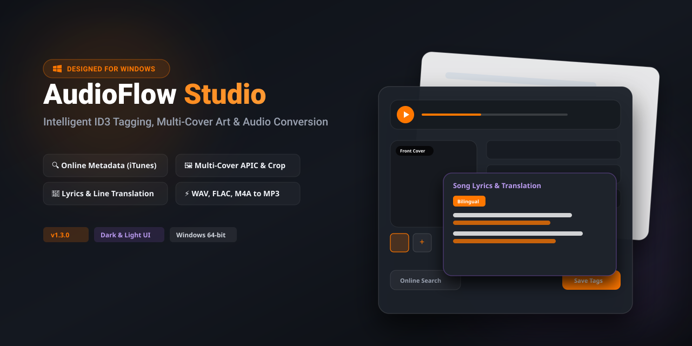

<div align="center">

# 🎵 AudioFlow Studio

**Modern MP4 to MP3 Converter & Intelligent Multi-Cover ID3 Tag Editor**

[](https://github.com/HadiDastangoo/AudioFlow-Studio/releases)
[](LICENSE)
[](https://github.com/HadiDastangoo/AudioFlow-Studio/releases)
[](https://www.python.org/)

<!-- [PLACEHOLDER: Add App Banner / Main Interface Screenshot Here] -->


<p align="center">
  <a href="#-key-features">Key Features</a> •
  <a href="[#installation--download]">Download</a> •
  <a href="#how-to-use">How to Use</a> •
  <a href="#building-from-source">Build from Source</a> •
  <a href="#tech-stack">Tech Stack</a>
</p>

</div>

---

## 🌟 Overview

**AudioFlow Studio** is a lightweight, modern desktop application designed for music enthusiasts, curators, and audio editors. Built with a responsive **Glassmorphic Single Page Architecture**, it allows users to effortlessly extract audio from diverse media formats (MP4, MKV, FLV, M4A, etc.), convert them into high-fidelity MP3 files, search for online metadata, fetch and translate lyrics, and manage multi-cover ID3v2 metadata frames.

---

## 🚀 Key Features

### 🎧 Fast Media Extraction & Conversion
* Converts popular video and audio formats (`MP4`, `MKV`, `FLV`, `M4A`, `WAV`, `AAC`) into standard, high-quality **MP3 (VBR Q2)** using optimized FFmpeg binaries.
* Drag-and-drop workflow with instant file detection.

### 🖼️ Full Multi-Cover ID3v2 APIC Support
* Supports embedding, editing, and managing multiple artwork types:
  * **Front Cover (Main)**, **Back Cover**, **Lead Artist**, **Composer**, **Band / Orchestra**, **Lyricist**, **Recording Location**, **Illustration**, **Artist Logo**, and **Publisher / Studio Logo**.
* Built-in interactive **1:1 square cropper** with zoom and pan controls.
* High-resolution cover art fetching, direct clipboard copying, and cover image saving.

<!-- [PLACEHOLDER: Add Multi-Cover Strip & Cropper Modal Screenshot Here] -->
<!-- Example:  -->

### 🏷️ Comprehensive Metadata & Extended Tags
* Standard tags: `Title`, `Artist`, `Album`, `Genre`, `Composer`, `Year`, `Track #`, `Disc #`, `Copyright`, `Comment`.
* **Extended ID3v2 Tags:** Collapsible accordion for `Publisher / Label (TPUB)`, `Mood (TMOO)`, `BPM (TBPM)`, `Original Artist (TOPE)`, `ISRC (TSRC)`, and `Unsynchronized Lyrics (USLT)`.
* Intelligent LTR alignment for metadata fields across all UI languages.
* Custom right-click **Context Menu** with native clipboard integration (`Cut`, `Copy`, `Paste`, `Select All`).

### 🔍 Online Metadata Search & Release Inspector
* Query Apple iTunes Search API directly from track information.
* Grid and List layout toggles with detailed metadata previews.
* One-click action buttons to apply tags, artwork, or both.

<!-- [PLACEHOLDER: Add Online Search Results Modal Screenshot Here] -->
<!-- Example:  -->

### 📜 Lyrics Viewer, Translation & Paragraph Formatting
* Automated lyrics fetching via **LRCLIB**.
* Built-in paragraph translation powered by **MyMemory API** with rate-limit chunking.
* **Three distinct viewing modes:**
  * `Original`: View pristine source lyrics.
  * `Translation`: Display clean translated text.
  * `Original + Translation`: Synchronized, line-by-line bilingual alignment.
* Windows CRLF (`\r\n`) line break normalization ensures formatted text is preserved across external text editors.

<!-- [PLACEHOLDER: Add Lyrics Modal Screenshot Here] -->
<!-- Example:  -->

### 🎛️ Modern Built-in Audio Player
* Embedded HTML5 audio player designed for desktop playback without WebView file protocol security blocks.
* Smooth seekbar timeline, volume slider, time tracking, and automatic playback reset on new file loads.

### 🌍 Multilingual & Modern Design
* Fully localized in **English** and **Persian (فارسی)** with embedded typography (**Vazirmatn**).
* Adaptive themes: **System Default**, **Light**, and **Dark** modes.
* Persistent user preferences saved locally in `config.json`.
* Built-in GitHub update checker displaying download size and changelogs.

---

## 📥 Installation & Download

Pre-compiled, standalone executables for Windows are available on the Releases page:

1. Download the latest `AudioFlow-Studio-vX.X.X.exe` from [**Releases**](https://github.com/HadiDastangoo/AudioFlow-Studio/releases).
2. Run the executable directly — **no installation or external Python setup required**.

---

## 🛠️ How to Use

1. **Load Media:** Drag and drop an audio/video file onto the drop zone, or click to browse.
2. **Convert (If non-MP3):** Click **"Convert to MP3"** to extract audio.
3. **Fetch Metadata:** Enter a title or artist and click **"Search Online Metadata"** to fetch official release info and high-res album covers.
4. **Get Lyrics:** Inspect an online release, click **"Lyrics"**, and optionally click **"Translate"** to get side-by-side translated lines.
5. **Manage Covers:** Add new cover types (+ button) or click an existing cover to crop/delete.
6. **Save Tags:** Click **"Save Tags"** to write all changes directly to the MP3 file.

---

## 💻 Building from Source

### Prerequisites
* Python 3.8 or higher
* Git

### Setup
```bash
# Clone the repository
git clone [https://github.com/HadiDastangoo/AudioFlow-Studio.git](https://github.com/HadiDastangoo/AudioFlow-Studio.git)
cd AudioFlow-Studio

# Create and activate a virtual environment
python -m venv venv
# On Windows:
venv\Scripts\activate
# On Linux/macOS:
source venv/bin/activate

# Install dependencies
pip install -r requirements.txt
