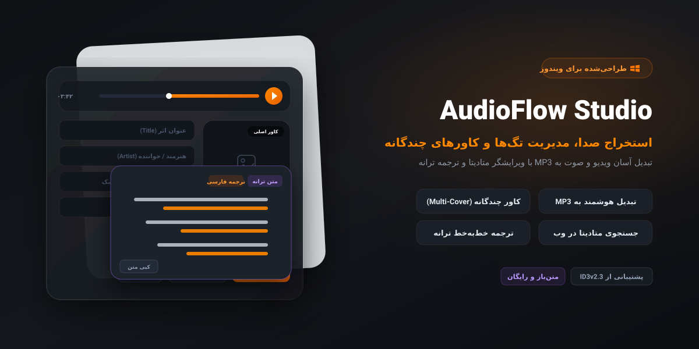

<div align="center">

# 🎵 AudioFlow Studio

**نرم‌افزار مدرن تبدیل رسانه به MP3 و ویرایشگر پیشرفته متادیتا و کاورهای چندگانه ID3v2**

[](https://github.com/HadiDastangoo/AudioFlow-Studio/releases)
[](LICENSE)
[](https://github.com/HadiDastangoo/AudioFlow-Studio/releases)
[](https://www.python.org/)



<p align="center">
  <a href="#ویژگی‌های-کلیدی">ویژگی‌های کلیدی</a> •
  <a href="#نصب-و-دریافت">نصب و دانلود</a> •
  <a href="#راهنمای-استفاده">راهنمای استفاده</a> •
  <a href="#اجرا-از-سورس-کد">اجرا از سورس‌کد</a> •
  <a href="#پشته-فنی-tech-stack">پشته فنی</a> •
  <a href="README.md">English</a>
</p>

</div>

---

## 🌟 معرفی برنامه

برنامه **AudioFlow Studio** یک ابزار رومیزی سبک، سریع و مدرن برای ویرایش متادیتا و مدیریت فایل‌های صوتی است. این نرم‌افزار بر پایه معماری تک‌صفحه‌ای (SPA) و طراحی چشم‌نواز **Glassmorphism (شیشه‌ای)** ساخته شده و به شما این امکان را می‌دهد تا بدون نیاز به دانش فنی پیچیده، صدای فایل‌های ویدیویی و صوتی گوناگون را استخراج و به فرمت باکیفیت MP3 تبدیل کنید، به جستجوی آنلاین اطلاعات آلبوم و قطعات بپردازید، متن ترانه‌ها را همراه با ترجمه دریافت کنید و چندین کاور مختلف را در استاندارد ID3v2 مدیریت و ذخیره نمایید.

---

## 🚀 ویژگی‌های کلیدی

### 🎧 استخراج و تبدیل سریع فایل‌های رسانه‌ای
* استخراج صدا و تبدیل انواع فرمت‌های ویدیویی و صوتی رایج (`MP4`, `MKV`, `FLV`, `M4A`, `WAV`, `AAC`) به فایل استاندارد و باکیفیت **MP3 (VBR Q2)** به کمک کتابخانه بهینه‌شده FFmpeg.
* امکان کشیدن و رها کردن فایل‌ها (Drag & Drop) همراه با تشخیص آنی فرمت و وضعیت رسانه.

### 🖼️ پشتیبانی کامل از کاورهای چندگانه (Multi-Cover ID3v2 APIC)
* قابلیت افزودن، ویرایش، حذف و ذخیره‌سازی انواع استانداردهای تصویر در فایل صوتی:
  * **کاور اصلی (Front Cover)**، **کاور پشت (Back Cover)**، **هنرمند اصلی (Lead Artist)**، **آهنگساز (Composer)**، **گروه / ارکستر (Band)**، **ترانه‌سرا (Lyricist)**، **محل ضبط (Recording Location)**، **تصویرسازی (Illustration)**، **لوگوی هنرمند (Artist Logo)** و **لوگوی استودیو/ناشر (Publisher Logo)**.
* ابزار داخلی برش مربعی (1:1 Square Crop) با کنترل‌های بزرگ‌نمایی (Zoom) و جابه‌جایی تصویر (Pan).
* بارگذاری مستقیم کاورهای باکیفیت از اینترنت، کپی در کلیپ‌بورد سیستم و ذخیره مستقیم تصویر روی دیسک.

<!-- [محل قرارگیری تصویر: نوار کاورهای چندگانه و پنجره برش تصویر] -->
<!-- نمونه:  -->

### 🏷️ متادیتای جامع و تگ‌های پیشرفته (Extended Tags)
* ویرایش تمامی فیلدهای استاندارد: عنوان (Title)، هنرمند (Artist)، آلبوم (Album)، سبک (Genre)، آهنگساز (Composer)، سال (Year)، شماره ترک (Track #)، شماره دیسک (Disc #)، کپی‌رایت (Copyright) و توضیحات (Comment).
* **پنل کشویی فیلدهای پیشرفته:** تنظیم ناشر / لیبل (TPUB)، حس و حال (TMOO)، تمپو / ضرب‌آهنگ (TBPM)، خواننده اصلی (TOPE)، شناسه استاندارد بین‌المللی کالا (TSRC) و متن ترانه غیرهماهنگ (USLT).
* تنظیم خودکار چیدمان و جهت متن فیلدهای تگ به صورت چپ‌به‌راست (LTR) در تمامی زبان‌ها به منظور حفظ نظم ورودی‌ها (به جز فیلد ترانه).
* منوی راست‌کلیک (Context Menu) سفارشی با قابلیت‌های برش (Cut)، کپی (Copy)، جایگذاری (Paste) و انتخاب همه (Select All) با ارتباط مستقیم به کلیپ‌بورد سیستم‌عامل.

### 🔍 جستجوی آنلاین اطلاعات و مشاهده جزئیات انتشار
* جستجوی سریع اطلاعات قطعه و آلبوم از طریق پایگاه داده iTunes Search API اپل بر اساس نام اثر و هنرمند.
* تغییر نمای نمایش نتایج بین دو حالت **شبکه‌ای (Grid)** و **لیستی (List)** به همراه پیش‌نمایش متادیتا.
* دکمه‌های مجزا برای درج انتخابی تگ‌ها، درج کاور یا اعمال هم‌زمان همه موارد.

<!-- [محل قرارگیری تصویر: نتایج جستجوی آنلاین] -->
<!-- نمونه:  -->

### 📜 متن ترانه، ترجمه خط‌به‌خط و حفظ قالب پاراگراف‌ها
* دریافت خودکار متن قطعه از پایگاه داده **LRCLIB**.
* سیستم ترجمه بند به بند متصل به **MyMemory API** با مکانیزم شکست متن جهت پایداری اتصال و جلوگیری از خطای سقف درخواست.
* **سه حالت نمایش در مدال ترانه:**
  * `Original`: نمایش متن خام و اصلی ترانه.
  * `Translation`: نمایش صرفاً متن ترجمه‌شده.
  * `Original + Translation`: چینش خط‌به‌خط و متناظر متن اصلی و ترجمه.
* استانداردسازی شکست خطوط با فرمت CRLF (`\r\n`) برای جلوگیری از به‌هم‌چسبیدن خطوط هنگام کپی و انتقال متن به سایر ویرایشگرها.

<!-- [محل قرارگیری تصویر: پنجره نمایش ترانه و ترجمه] -->
<!-- نمونه:  -->

### 🎛️ پلیر صوتی مدرن و توکار
* پخش‌کننده صوتی مبتنی بر HTML5 هماهنگ با موتور WebView2 بدون مسدودیت پروتکل فایل‌های محلی.
* نوار پیشرفت نرم (Seekbar)، اسلایدر تنظیم بلندی صدا، نمایش زمان سپری‌شده و زمان کل، و توقف خودکار به محض لود هر فایل جدید.

### 🌍 چندزبانه و طراحی مدرن
* پشتیبانی کامل از دو زبان **فارسی** و **انگلیسی** همراه با فونت محلی و توکار **وزیرمتن (Vazirmatn)**.
* پشتیبانی از سه حالت پوسته ظاهری: **پیش‌فرض سیستم (System)**، **روز (Light)** و **شب (Dark)**.
* ذخیره خودکار تنظیمات مسیر خروجی، رونویسی فایل و پوسته در فایل `config.json`.
* سیستم بررسی خودکار و دستی نسخه‌های جدید برنامه در گیت‌هاب با نمایش حجم بیلد و توضیحات نسخه.

---

## 📥 نصب و دریافت

فایل‌های اجرایی مستقل (Portable) برای ویندوز در بخش ریلیزهای گیت‌هاب در دسترس هستند:

1. آخرین نسخه فایل اجرایی (`AudioFlow-Studio-vX.X.X.exe`) را از بخش [**Releases**](https://github.com/HadiDastangoo/AudioFlow-Studio/releases) دریافت کنید.
2. فایل را مستقیماً اجرا کنید — **نیازی به نصب برنامه یا پیش‌نیازهای پایتون روی سیستم نیست**.

---

## 🛠️ راهنمای استفاده

1. **بارگذاری فایل:** فایل صوتی یا تصویری مورد نظر را در کادر اصلی رها کنید یا روی آن کلیک نمایید تا فایل را انتخاب کنید.
2. **تبدیل به MP3 (در صورت نیاز):** اگر فایل فرمتی غیر از MP3 دارد، دکمه **«تبدیل به MP3»** را بزنید تا عملیات استخراج انجام شود.
3. **جستجوی آنلاین:** نام آهنگ یا خواننده را وارد کرده و روی **«جستجوی آنلاین اطلاعات آهنگ»** کلیک کنید تا متادیتا و کاورهای رسمی دریافت شوند.
4. **متن ترانه:** در کارت نتایج، روی گزینه **«متن ترانه»** کلیک کرده و در صورت نیاز دکمه **«ترجمه»** را بزنید تا متن اصلی و ترجمه خط‌به‌خط نمایش داده شوند.
5. **مدیریت کاورها:** برای تغییر یا برش کاور روی آن کلیک کنید یا با کلیک روی علامت (+) سایر کاورها را به فایل اضافه نمایید.
6. **ذخیره‌سازی:** پس از تکمیل ویرایش، دکمه **«ذخیره اطلاعات آهنگ»** را بزنید تا تغییرات روی فایل ذخیره شوند.

---

## 💻 اجرا از سورس‌کد

### پیش‌نیازها
* پایتون ۳.۸ یا بالاتر
* ابزار Git

### راه‌اندازی
```bash
# کلون کردن مخزن
git clone [https://github.com/HadiDastangoo/AudioFlow-Studio.git](https://github.com/HadiDastangoo/AudioFlow-Studio.git)
cd AudioFlow-Studio

# ایجاد و فعال‌سازی محیط مجازی
python -m venv venv
# در ویندوز:
venv\Scripts\activate
# در لینوکس / مک:
source venv/bin/activate

# نصب کتابخانه‌های مورد نیاز
pip install -r requirements.txt
```

## اجرای برنامه
```bash
python app.py
```
بیلد فایل اجرایی تک‌فایل (Windows EXE)
جهت بسته‌بندی برنامه در قالب یک فایل اجرایی واحد بدون نیاز به نصب پایتون:

```bash
pyinstaller --noconsole --onefile --clean --name="AudioFlow-Studio-v1.2.1" --icon="icon.ico" --add-data="Vazirmatn.ttf;." --add-data="icon.ico;." app.py
```

## 🏗️ پشته فنی (Tech Stack)
GUI Engine: کتابخانه pywebview مبتنی بر موتور Microsoft Edge WebView2.

Tagging Engine: کتابخانه mutagen بر پایه استاندارد ID3v2.3.

Media Processing: ماژول imageio-ffmpeg و باینری FFmpeg.

Image Processing: کتابخانه Pillow (PIL).

Frontend: ترکیب Vanilla HTML5, Modern CSS3 (Glassmorphism), ES6+ JavaScript.

APIs: سرویس‌های Apple iTunes Search API, LRCLIB API و MyMemory Translation API.

Typography: قلم استاندارد وزیرمتن (تزریق آفلاین با کدگذاری Base64).

## 📄 مجوز (License)
این پروژه تحت مجوز MIT منتشر شده است. برای کسب اطلاعات بیشتر فایل LICENSE را مطالعه فرمایید.
